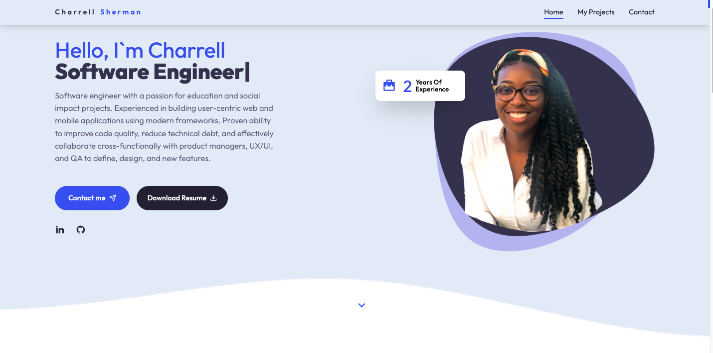
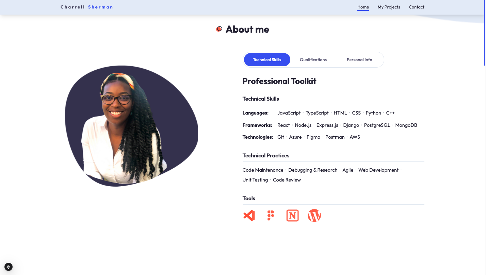
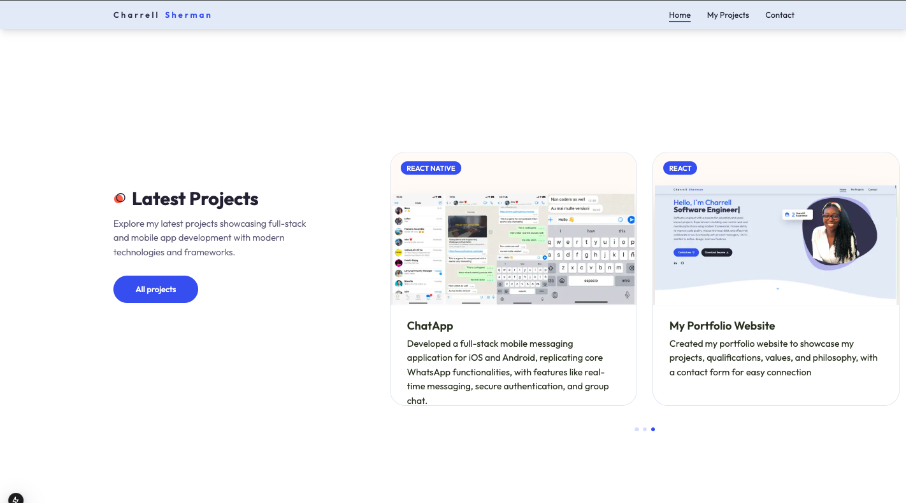
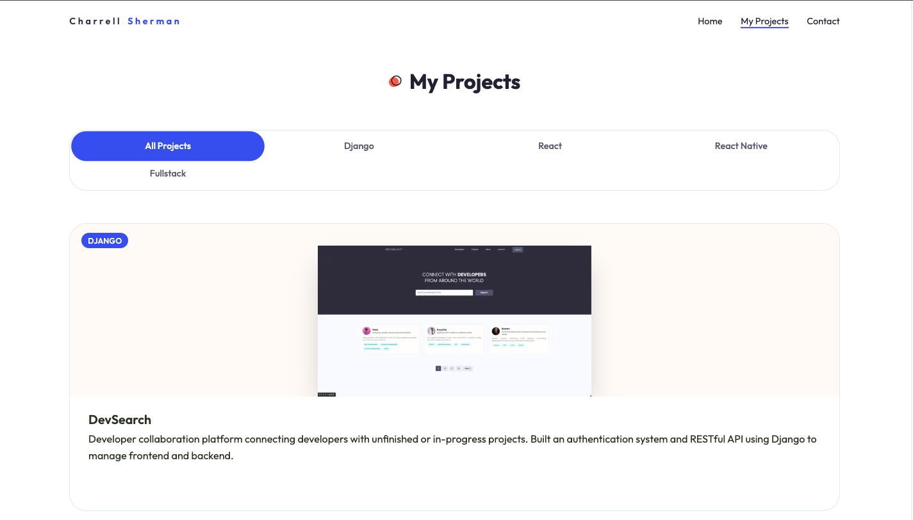
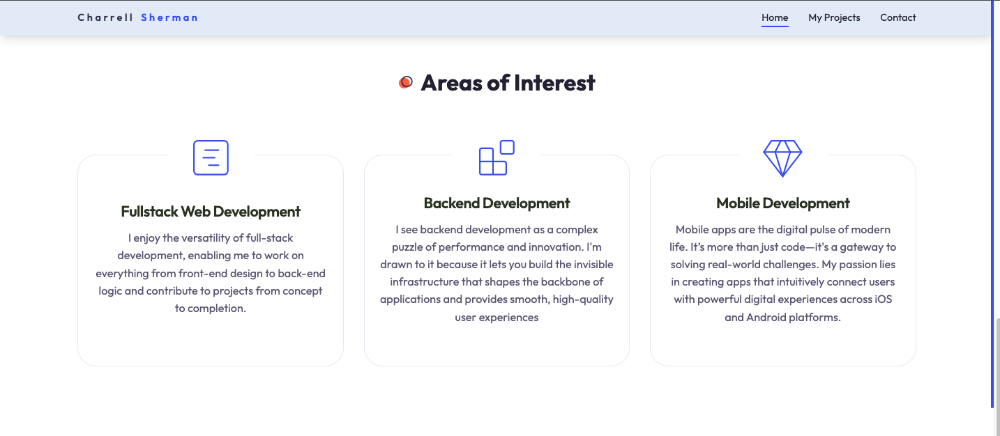
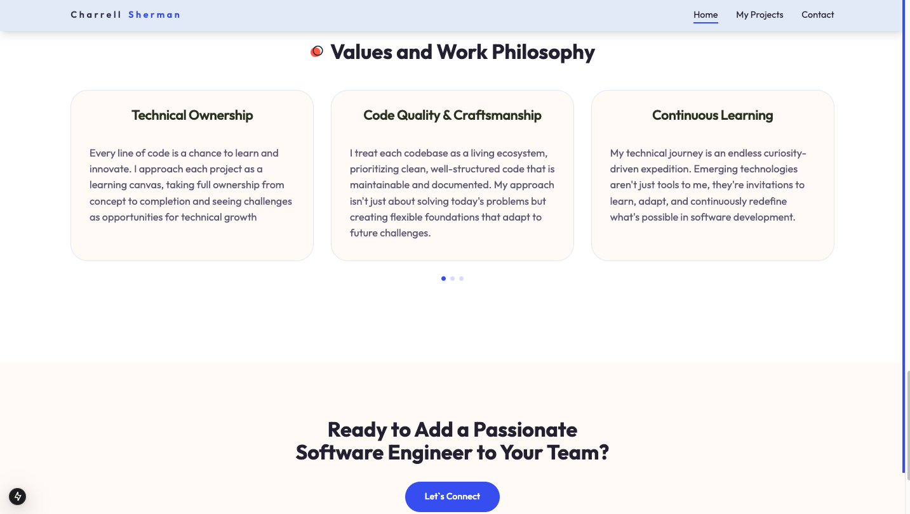
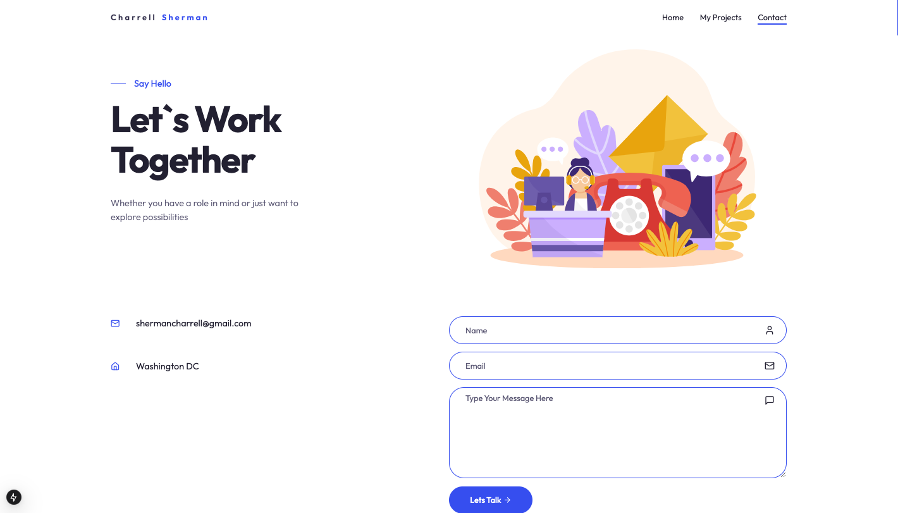

# Charrell's Portfolio Website

## Project Overview

My portfolio website was designed to showcase my technical expertise while practicing and demonstrating modern web development skills. Built using the MERN stack (MongoDB Express.js React Node.js)along with Next.js and Tailwind, this project highlighs responsive design, efficient development practices, and seamless user experiences. It also serves as a platform to explore integration and deployment strategies for a fully functional and professional online presence.

## Motivation

### The primary goals of this project were to:

- Practicing Backend Development
- Enhancing Full-Stack Development Skills
- Exploring Deployment Strategies
- Showcasing Technical Expertise

## Tech Stack

### Frontend

    - React: Framework
    - Redux: State management
    - JavaScript: Language

### Backend

    - Mongoose: Database
    - Node.js: Runtime
    - Express.js: Backend framework

## Key Features

- Responsive Design
- Dynamic Frontend
- Custom Styling with Tailwind CSS
- Interactive Contact Form

## Screenshots

Landing Page

About

Latest Projects

My Projects

Interests

Values

Contact me

## Learning Outcomes

- Mobile app development with React Native
- Implementing real-time features
- Cloud-based backend integration
- GraphQL API design
- Mobile UI/UX design principles

## Credit

Inspired by [Cristian Mihai](https://www.youtube.com/watch?v=Rew98iFupBM) tutorial

## Future Improvements

- Enhanced Interactivity
- Dark Mode
- Web Accessibile
